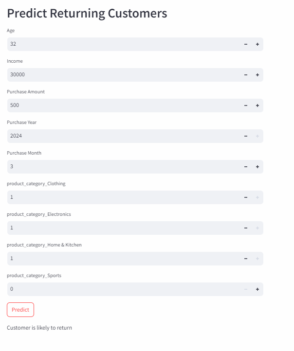

# Customer_Analysis
This project will analyze if a customer will return based on the transaction had. 

## Scope
- We will clean the data, Perform and EDA, create a machine learning model that will predict if someone will return for purchase or not. We will make Dashboard for the same. 

## Steps to the project. 

### Part 1: Data Preparation
1. Load the data
2. Inspect the data
3. Handle missing values in the data
4. Convert the data types 

### Part 2: EDA
1. Basic plots

### Part 3: Feature Engineering
1. Extract Features
2. Encode Categorical Features

### Part 4: Machine Learning
1. Prepare data for Modelling
2. Train the model

### Part 5: Create a Dashboard with Streamlit
1. Install the streamlit
2. Create streamlit application 
3. Run the Applications